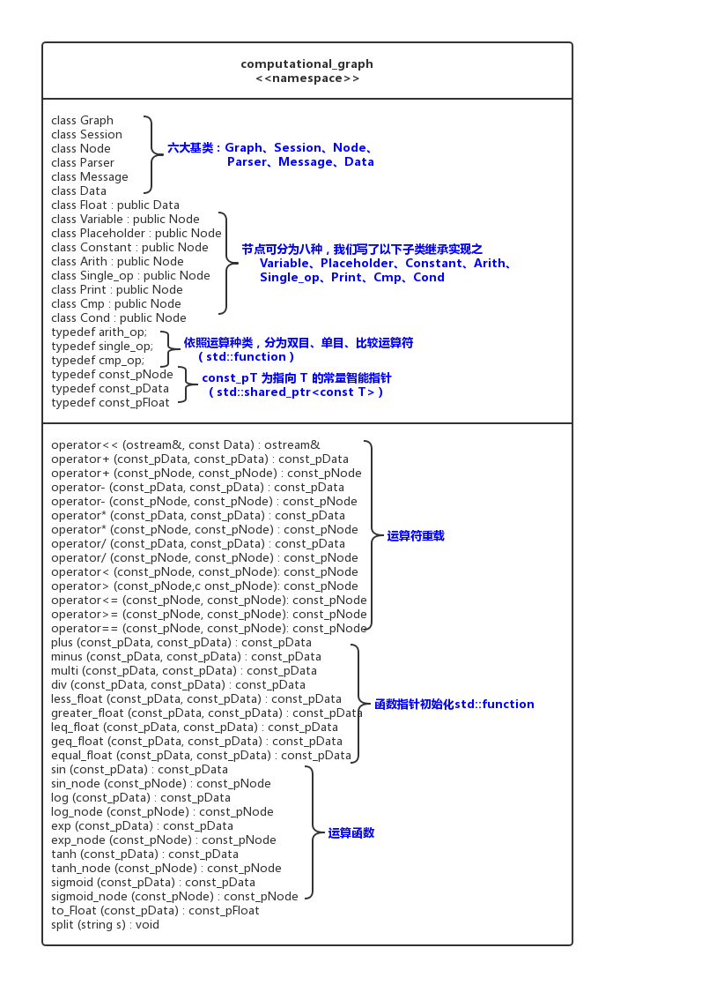
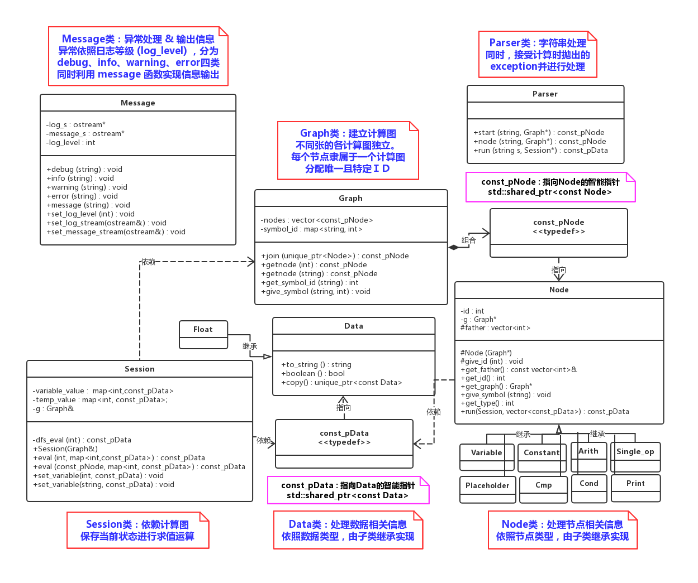
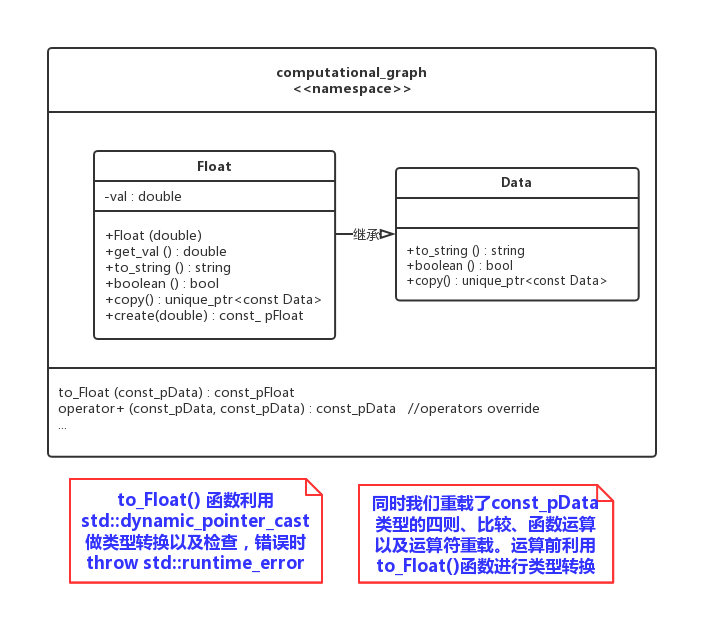

# 计算图第一阶段说明文档

## 整体结构、封装、接口
本次作业中, 我们写出了六个主要的类: ```Graph```, ```Session```, ```Node```,  ```Data```， ```Parser```， ```Message``` 以及若干派生类实现计算图的功能。 以下UML图给出了各类的相关关系以及接口。

(备注 : +代表public, #代表protected, -代表private）

### 命名空间 (UML-namspace.png)
我们本次所有类、函数都写于```computational_graph```的命名空间中, 於主函数调用


### 六大类 (UML-Base.png)


### Node以及其派生基类 (UML-Node.png)


### Data以及派生Float类 (UML-Data.png)


以上是我们所有的接口与函数, 现在我们就各个类探讨其功能，并给出相关注意事项。

```example_test.cpp```给出了一组测试，并示范了这个库的推荐使用方式。你可以使用```make test```编译它。  
```oj_main.cpp```使用此库按照OJ要求的输入输出格式进行测试。你可以使用```make```编译它。

## Graph类

```Graph```类的实例以```nodes```成员管理一组节点连成的一张计算图，按加入图中的顺序分配ID。一个节点(```Node```及其派生类对象)在刚创建出时，成员```id```的值为-1。随后它会通过调用一个```Graph```对象的```join```方法被加入图的管理并分配ID。你不应该调用```Graph```的```join```方法，也不应该手动创建出一个```Node```及其派生类的对象（这也是不可能的）。上述过程会通过相应派生类的静态```create```方法完成，并返回指向被创建的节点的智能指针。此时它已经在某一```Graph```的管理之下了。

它还会管理标识符到编号的映射，并支持将标识符重新绑定到其他节点上，利用标识符查找节点。在库的正常使用中并不会用到这一功能，但是这次作业中可以用到，处理读入的节点名称。**实际上，使用这个库时，我们推荐你不用到节点的编号与标识符。**

```Graph```会按照加入节点的顺序将```Variable```节点的编号记录在```variable_id```中，这是为了让```Session```类可以在新变量加入时处理其默认值。

### 成员函数

```cpp
+const_pNode join(std::unique_ptr<Node> curnode)
```
接管```curnode```并分配编号。你不应该调用这一方法。

```cpp
+const_pNode getnode(int id)
```
返回指向这一编号对应节点的智能指针。如果```id```不是合法编号，行为是未定义的。

```cpp
+const_pNode getnode(std::string symbol)
```
返回指向这一标识符对应节点的智能指针。如果```symbol```不是合法标识符，行为是未定义的。

```cpp
+int get_symbol_id(std::string symbol)
```
返回这一标识符对应的节点编号。如果```symbol```不是合法标识符，行为是未定义的。

```cpp
+void give_symbol(std::string symbol,int id)
```
将```symbol```作为标识符绑定到编号为```id```的节点上。如果```id```不是合法的编号，结果是未定义的。

## Session类

```Session```的一个实例是一个“会话”，关联着一个```Graph```实例，并通过```variable_value```管理着这张图中```Variable```节点的一组取值状态。同一张计算图的不同会话中，```Variable```节点可能有不同的取值状态。

```last_variable_id```成员记录着最后一个被初始化的```Variable```节点。每次求值前，将还未初始化的节点默认值加入```variable_value```，然后再进行求值。求值时，```temp_value```暂存已经求值的节点结果与```Placeholder```节点的值。

### 成员函数

```cpp
+Session(Graph &_g)
```
构造一个绑定在```_g```上的```Session```对象，并初始化已经被加入```_g```的```Variable```节点。

```cpp
+Graph* get_graph()
```
返回指向该会话绑定的```Graph```对象的指针。

```cpp
+const_pData eval(int id,std::map<int,const_pData> placeholder_value)
```
以```placeholder_value```表示的编号到值的映射作为```Placeholder```节点的取值，对编号为```id```的节点求值。可能抛出```std::range_error```, ```std::invalid_argument```, ```std::runtime_error```异常。

```cpp
+const_pData eval(const_pNode p,std::map<const_pNode,const_pData> placeholder_value)
```
以```placeholder_value```表示的节点到值的映射作为```Placeholder```节点的取值，对```p```指向的节点求值。可能抛出```std::range_error```, ```std::invalid_argument```, ```std::runtime_error```异常。  
如果```p```指向的节点并非此图中的合法节点，则引发```Message::error```并返回```nullptr```  
如果```placeholder_value```中的节点并非```Placeholder```节点，则会引发```Message::warning```  
*(recommended)*

```cpp
+void set_variable(int id,const_pData v)
```
更改编号为```id```的```Variable```节点的取值。不会直接接管```v```指向的对象，而是将其复制一份。

```cpp
+void set_variable(std::string symbol,const_pData v)
```
更改标识符为```symbol```的```Variable```节点的取值。不会直接接管```v```指向的对象，而是将其复制一份。

```cpp
+void set_variable(const_pNode p,const_pData v)
```
更改```p```指向的```Variable```节点的取值。不会直接接管```v```指向的对象，而是将其复制一份。  
*(recommended)*

## Node类
```Node```是节点类的基类。它的对象被```Graph```管理，并可通过```get_graph()```方法获取其所在的```Graph```对象的指针。  
一个```Node```基类对象不应当被创建出来，因此其构造函数是```protected```的。它的子类对象也不应当直接被创建出来，而是通过```create```静态方法（参见```Graph```类的文档）创建。  
```father```成员存储着它所依赖的前驱节点的编号。不同类型的节点（对应着不同的派生类）有不同的```father```长度。

### 成员函数

```cpp
#Node(Graph *_g)
```
创建的对象所属图为```_g```指向的```Graph```实例，依赖节点为空。

```cpp
#Node(Graph *_g,std::vector<int> _father)
```
创建的对象所属图为```_g```指向的```Graph```实例，依赖节点编号为```_father```

```cpp
#void give_id(int newid)
```
改变```Node```对象中存储的编号。此方法只会在```Graph```的```join```方法中调用一次，将默认值```-1```改为```newid```

```cpp
+const std::vector<int> &get_father() const
```
返回对依赖节点编号列表的引用。

```cpp
+int get_id() const
```
返回图中的编号。

```cpp
+Graph *get_graph() const
```
返回其所在```Graph```对象的指针。

```cpp
+void give_symbol(std::string symbol) const
```
在其所在的```Graph```对象中将```symbol```绑定到此节点上。

#### 虚函数及其在子类中的实现

```cpp
+virtual int get_type() const
```
+ Node：返回0
+ Variable: 返回1
+ Placeholder: 返回2
+ Constant: 返回3
+ Arith: 返回4
+ Single_op: 返回5
+ Print: 返回6
+ Cmp: 返回7
+ Cond: 返回8

```cpp
+virtual const_pData run(Session *sess,std::vector<const_pData> father_value) const
```
可能抛出```std::runtime_error```或```std::range_error```异常。  
+ Node类：引发```Message::error```并返回```nullptr```
+ Variable : 运行时会引发```Message::warning```并返回```default_value```
+ Placeholder : 运行时会引发```Message::error```并返回```nullptr```
+ Constant : 返回```value```
+ Arith : 若```father_value```的长度不为2, 则引发```Message::error```并返回```nullptr```
+ Single_op：若```father_value```的长度不为1，则引发```Message::error```并返回```nullptr```
+ Print：若```father_value```的长度不为1，则引发```Message::error```并返回```nullptr```
+ Cmp：若```father_value```的长度不为2，则引发```Message::error```并返回```nullptr```
+ Cond：若```father_value```的长度不为3，则引发```Message::error```并返回```nullptr```

## Variable类 (继承Node类)

```Variable```类用于管理变量类型的节点,  当读入变量类型```V```后利用初始数值赋值给私有属性```default_value```。 

### 构造函数
```cpp
# Variable(Graph *_g, const_pData default_v)
```
```variable```的构造不直接接管传入的智能指针```default_v```, 而是利用```Data::copy()```创立新对象并拷贝一份

### 成员函数
```cpp
+ static const_pNode create(Graph *g,const_pData default_v)
```
用于在给定的图中，利用给定的默认值创建```Variable```节点返回其智能指针。

```cpp
+ const_pData get_default_value() const
```
返回默认值。

##　Placeholder类（继承Node类）
```Placeholder```类用于创建占位符，即需要在计算时对其进行赋值的节点，若发现求值所依赖的占位符未赋值，则输出错误信息。
### 构造函数
```cpp
# Placeholder(Graph *_g)
```

### 成员函数
```cpp
+ static const_pNode create(Graph *g)
```

## Constant类 (继承Node类)
```Constant```类用于创建常量节点。节点在创建时即给定其默认值```value```，在计算过程中无法对其赋值，也无法修改其默认值。
### 构造函数
```cpp
# Constant(Graph *_g,const_pData v)
```
```Constant```的构造不直接接管传入的智能指针```v```, 而是利用```Data::copy()```创立新对象并拷贝一份。

### 成员函数
```cpp
+ static const_pNode create(Graph *g,const_pData v)
```
用于在给定的图中，拷贝传入的智能指针来构建新节点，赋值给```value```并返回其智能指针。

## Arith类 (继承Node类)
为了保持代码简洁, 我们将```arith_op```类型定义为接受两个```const_pData```为参数并返回运算结果为```const_pData```的```std::function```
同时, 建立一个四则运算表```static map<string, arith_op> str2op```存放从```string```到```arith_op```的映射关系

### 构造函数
```cpp
# Arith(Graph *_g, int left_id, int right_id, std::string op_str)
```
左端运算节点id为```left_id```, 右端运算节点id为```right_id```, 运算符为```op_str```。注意到如果在四则运表```str2op```中找不到```op_str```对应的运算，则调用```Message::error```并以预设的加法处理

### 成员函数
```cpp
+ static const_pNode create(const_pNode left,const_pNode right,std::string op_str)
```
用于在给定左右节点以及四则运算符时，创建新节点。会进行对```left```和```right```的必要检查。

## Single_op类（继承Node类）
```Single_op```类用于处理一元函数运算。为了保持代码简洁, 我们将```single_op```类型定义为接受一个```const_pData```为参数并回传运算结果为```const_pData```的```std::function```。类的静态私有成员```str2op```中用```map```实现了不同字符串与相应运算```(sin,log,exp,tanh,sigmoid)```的```single_op```对象的关联。

### 构造函数
```cpp
#Single_op(Graph *_g, int x_id, std::string op_str)
```

### 成员函数
```cpp
+static const_pNode create(const_pNode x, std::string op_str)
```
根据已有节点及运算符字符串创建新节点，并返回其智能指针。会进行对```x```的必要检查。

## Print类（继承Node类）
```Print```类实现了对节点值的打印功能。每次计算时，都利用```Message::message```输出前驱节点的值。

### 构造函数
```cpp
#Print(Graph *_g,int x_id,std::string x_symbol);
```
通过给出的前趋节点编号创建```Print```节点，在输出时将```x_symbol```作为前驱节点名称。

### 成员函数
```cpp
+const_pNode create(Graph *_g, int x_id, std::string x_symbol)
+const_pNode create(const_pNode x, std::string x_symbol)
```
提供了两种方法创建新节点
1. 在给定图中由节点编号与名称创建新节点
2. 由指向前驱节点的智能指针与标识符来创建新节点。*(recommended)*

## Cmp类(继承Node类)
```Cmp```类实现了对于比较运算符的处理。为了保持代码简洁, 我们将```cmp_op```类型定义为接受两个```const_pData```为参数并回传运算结果为```const_pData```的```std::function```。在类的静态私有成员```str2op```中用```map```实现了字符串与相应比较运算```(<,>,<=,>=,==)```的```cmp_op```对象之间的关联。

### 构造函数
```cpp
#Cmp(Graph *_g, int left_id, int right_id, std::string op_str)
```
参数包含节点所在的图，左右节点的id，以及比较运算符。

### 成员函数
```cpp
+static const_pNode create(const_pNode left, const_pNode right, std::string op_str)
```
用于在给定左右节点以及比较运算符时创建新节点。会进行对```left```和```right```的必要检查。

## Cond类（继承Node类）
```Cond```类实现了根据条件判断选择不同前驱节点计算结果的功能。当条件节点的计算结果向布尔的转换为真时，选择“真”节点，否则选择“假”节点。

### 构造函数
```cpp
#Cond(Graph *_g,int cond_id,int true_id,int false_id)
```

### 成员函数
```cpp
static const_pNode create(Graph *g,int cond_id,int true_id,int false_id)
static const_pNode create(const_pNode cond_node,const_pNode true_node,const_pNode false_node)
```
提供了两种方法创建新节点：
1. 在给定图中依据条件节点id与真假节点id创建新节点
2. 由指向条件节点和真假节点的智能指针来创建新节点。*(recommended)*

## Data类

为了保持代码简洁, 我们将```const_pData```定义为指向Data类对象的常量智能指针

节点的数据由```Data```以及其派生类负责管理。**```Data```基类作为管理层，是所有数据类型(目前只实现Float)的父类，没有```val```值**。在```Data.cpp```中我们写出了智能指针```const_pData```类的单目运算、比较运算、四则运算等函数并重载了加减乘除以及输出流运算符, 使得```Session```类中进行dfs计算时能够顺利运行。同时, 为了维护计算图的安全性，在运算前我们实现```to_Float()```函数进行类型检查。**若试图在```Data```基类或是空指针上运算，会抛出```std::runtime_error```。**（任何时候你也不应该创建```Data```对象进行运算)。  

同时，因为输出前往往需要进行数据类型转换，我们利用虚函数的方式写出了两个接口让子类继承实现 : ```to_string()``` 、```boolean()```。 注意到, 为确保数据安全，任何时刻你都**不应该调用```Data```基类中的这两个函数**，否则我们给出错误提示。而虚函数```copy()```功能在于不直接接管指针，而是新创一个相同的新对象, 并返回指向新对象的智能指针。 因为在子类有```override```, 实际使用时会依照对象的实际类型并返回正确类型的智能指针。

基本上，```Data类```负责计算图中节点的数据**管理**，你**不需要**也没必要刻意**调用**它。

### 成员函数 (都是虚函数, 子类重新实现)

```cpp
+ virtual std::string to_string() const
```
提供子类接口 , 调用时会调用```Message::error()```报错。

```cpp
+ virtual bool boolean() const
```
提供子类接口 , 调用时会调用```Message::error()```报错。

```cpp
+ virtual std::unique_ptr<const Data> copy() const
```
创建新对象，返回指向新对象(类型为```Data```)的智能指针，```Node```类会用到。


## Float类 (继承Data类)

为了保持代码简洁, 我们将```const_pFloat```定义为指向Float类对象的常量智能指针

```Float```子类才算真正拥有私有数据```val```的对象，并能够进行实际的运算。我们利用初始化列表写出能利用```init_v```的值来创建新对象的构造函数, 同时写出```create()```静态方法用于创建```Float```对象并返回其智能指针。 而公有函数```get_val()```用于得到私有的```val```值。

### 构造函數
```cpp
+ Float(double init_v)
```

### 成员函数 
```cpp
+ static const_pFloat create(double init_v)
```
得到指向以```init_v```为值创建的```Float```类对象的智能指针。

```cpp
+ double get_val() const;
```
得到该对象存储的浮点值

```cpp
+ virtual std::string to_string() const
```
返回一个用于输出的```std::string```对象, 我们利用```sprintf```设定为四位小数。(缓冲区的长度定为50)

```cpp
+ virtual bool boolean() const
```
返回一个向布尔的类型转换。 注意到因为```COND```要求, 我们约定```eps = 1e-7``` 并在```val > eps```时得到真, 否则得到假。

```cpp
+ virtual std::unique_ptr<const Data> copy() const
```
将自身复制一份，创建新对象，返回指向新对象(类型为```Float```)的智能指针。

## Message类
```Message```类的设计目的在于输出信息。它的所有成员**均为静态成员**。  
我们将日志等级分为4级：```debug,info,warning,error```，并使其可调。  
```message```类型的输出则为正常的输出内容，例如用于```Print```节点。

```cpp
-int Message::log_level=3;
-std::ostream *Message::log_s = &std::cerr;
-std::ostream *Message::message_s = &std::cout;
```
类的私有成员包括日志等级```log_level```以及输出流指针```log_s，message_s```，由日志等级来判断是否输出相应错误信息，上面给出了其默认值。
```log_level```取值为1至4时分别对应```debug,info,warning,error```日志等级。例如```log_level```为3时只有```warning,error```类型的日志会被输出至```*log_s```

```cpp
+void Message::set_log_level(int level)
+void Message::set_log_stream(std::ostream &s)
+void Message::set_message_stream(std::ostream &s)
```
我们在类中提供了```set_log_level,set_log_stream,set_message_stream```函数，以实现对日志等级、输出流对象的可能的修改。  

```cpp
+void Message::debug(std::string s)
+void Message::info(std::string s)
+void Message::warning(std::string s)
+void Message::error(std::string s)
+void Message::message(std::string s)
```
```debug,info,warning,error```会在日志等级符合要求时输出至```*log_s```
```message```无论何时都会输出至```*message_s```

## Parser类
```Parser```类是一个额外提供的工具，用于解析OJ测试时描述计算图操作的语言。

我们设计了```split```函数，用于在将传入的字符串以```ch```分割为若干段并存进```std::vector<std::string>```中，便于进行下一步的操作。
```cpp
void split(std::string &s, std::vector<std::string> &res, char ch)
```

### 成员函数
```cpp
const_pNode start(std::string s, Graph *g)
```
用于创建出```Placeholder/Constant/Variable```类型节点并返回指向该节点的智能指针。

```cpp
const_pNode node(std::string s, Graph *g)
```
用于创建出依赖于其他节点的新节点，并返回新节点的智能指针。

```cpp
const_pData run(std::string s, Session *sess)
```
用于执行计算或赋值操作，并返回求值结果的智能指针（若为赋值，则返回空指针）。
